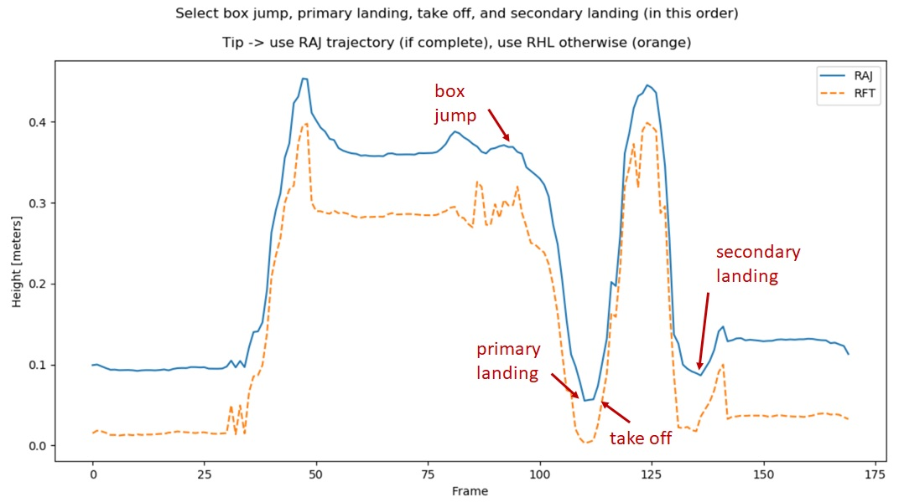

___

___

<em>For more information, visit <a href='http://www.dourthe.tech'>www.dourthe.tech</a></em>

# Motion capture processing for ACL Injury Screening

___ 
## Objective
Develop a series of algorithms enabling the import, processing and formatting of motion capture data generated by multiple sources (i.e. 2D Curv pose estimation pipeline, Microsoft Kinect 3D camera, multi-camera marker-based Vicon system, XSens inertial sensor suit).

___
## Content

| Code | Definition  |
| ---- |-------------|
| Curv\_processing.py | Algorithm used to import and process Curv data |
| find-joint-center.py | Function used to find the coordinates of a joint center using static and dynamic motion capture data |
| Kinect\_processing.py | Algorithm used to import and process Kinect data |
| kinect-2-mot.py | Algorithm used to format Kinect data into a motion file that can be read by OpenSim |
| OpenSim\_processing.py | Algorithm used to import and process Kinect data pre-processed using OpenSim |
| Vicon\_processing.py | Algorithm used to import and process Vicon data |
| Xsens\_processing.py | Algorithm used to import and process IMU data recorded with the XSens suit |

___
## Curv Processing

#### CODE
Curv_processing.py

#### DEPENDENCIES
Here is the list of functions required throughout the code:

| Function | Role  |
| ---------|-------|
| nan_find(y) | Generates a NaNs logical array where the indices of each NaN observation is True. Generates a local function that can extract the indices of each NaN observation as a list. |
| cubic_spline_fill(signal, mode=None) | Interpolates missing observations within a time series using a cubic spline. |
| cubic_spline_fill_3D(data, mode=None) | Applies cubic_spline_fill to each dimension of a 3D time series. |

#### SETTINGS

- **Main Directory and Data type:** Path to the Data folder and name of the type of data (here: 'Kinect', which is used in the PATHS DEFINITION section for import and export filenames).
- **List of participants:** specify the label of all selected participants (code will loop on this list).
- **List of trials:** specify what trials to include in the analysis (code will loop on this list).
- **List of key points:** DO NOT CHANGE (list of all landmarks tracked by the Curv algorithm).
- **Data columns:** DO NOT CHANGE (specific to the way Curv data are stored into each JSON file, necessary to read and process the data).
- **Data processing:** choose which pipeline to run:
    + joint_center_trajectories -> set to 1 to calculate joint centers velocity and acceleration and export the corresponding joint centers CSV files
    + biomechanical_variables -> set to 1 to calculate all biomechanical variables and export the corresponding joint centers CSV files
    + sf -> sampling frequency of the original colour video (in Hz)
    + event_detection -> set to 1 to allow the manual selection of events
    + interpolation -> set to 1 to interpolate missing observations using cublic splines (and select corresponding interpolation mode, as explained in the code)
- **Plotting:** set 'plot' to one to see the animated trials at the end of each loop (may lead to an error) and set 'save_animation' if you want to save the corresponding video (may also lead to an error).
- **Other settings:** no need to change.

#### EXCEPTIONS
Specify list of trials that are missing or compromised so the code can skip them.

#### PATHS DEFINITION
Define the import and export paths. This section was coded to match with the current Data Management architecture and could be simplified or changed depending on the user.

#### DATA IMPORT
Import raw data including the 2D trajectories of all tracked landmarsk.

#### DATA STRUCTURE & ALIGNMENT
Change the architecture of the data to match with Vicon and Kinect (i.e. create a column for X coordinates filled with zeros) and align the X and Y coordinates of all landmarks around X = 0 and Y = 0 (*i.e. substracting the mean of all X and Y coordinates over the whole trial*) and translate all Z coordinates to ensure that they are all > 0 (*i.e. substracting the min of all Z coordiantes over the whole trial*).

#### LANDMARKS SELECTION & LABELING
Select list of relevant landmarks and relabel them using a similar labeling system as used for Vicon and Kinect.

#### JOINTS VELOCITIES & ACCELERATIONS
Calculate the velocities and accelerations of each joint center's trajectory.

#### BIOMECHANICAL VARIABLES CALCULATION & EVENT DETECTION
Since the Curv pipeline doesn't provide any biomechanical variable calculation, this section of the code will calculate all biomechanical variables (*joint angles, KASR, functional tests metrics*) and run the event detection algorithm, which requires manual selection of landmarks, as illustrated below.

**Note:** Due to the 2D configuration of the Curv data, functional tests metrics such as max distance and time-to-2.5-meters during hop tests could not be assessed.

**Note:** The Curv data can appear very noisy (as illustrated below), making the manual selection of events challenging. Also, because of the fact that Curv data are 2D, so of the plots below (especially for the Timed Hop tests) may seem difficult to visualize. I may help to plot the trial's animation to see how each tracked landmark moves in space to better understand the data (if the plotting section works).

**EVENT DETECTION during DROP VERTICAL JUMP (DVJ)**

For each DVJ trial, the following figure will open and ask you to select 4 time landmarks:
- box jump
- primary landing
- take off
- secondary landing
Select these events using a similar method as shown in the figure below.

**Note:** no need to be extremely accuracte. You only need to click around the area where you believe the event happens. The code will then select the optimal event around the point that you selected.

**EVENT DETECTION during DISTANCE HOP TEST**

For each Distance Hop test, the following figure will open and ask you to select 4 time landmarks:
- take off
- landing

Select these events using a similar method as shown in the figure below.

**Note:** no need to be extremely accuracte. You only need to click around the area where you believe the event happens. The code will then select the optimal event around the point that you selected.

**EVENT DETECTION during TIMED HOP TEST**

For each Timed Hop test, the following figure will open and ask you to select one time langmark:
- take off

Select this event using a similar method as shown in the figure below.

**Note:** no need to be extremely accuracte. You only need to click around the area where you believe the event happens. The code will then select the optimal event around the point that you selected.

#### BIOMECHANICAL VARIABLES INTERPOLATION
If set to 1 in SETTINGS, interpolates all missing observations using cubic splines.

#### RESULTS EXPORT
Generate data frames for all processed results and export them in the destination folder in CSV format (if joint_center_trajectories == 1, or biomechanical_variables == 1 in SETTINGS).

#### 3D PLOTTING
This section plots the animated trial (after data alignment) for visual feedback.

___
## find_joint_center
#### Definition
Find the coordinates of a joint center using static and dynamic motion capture data (e.g. Vicon).
#### Input
    Os: nx3 array corresponding to the x, y, z coordinates of the static local origin (all frames)
    Xs: nx3 array corresponding to the x, y, z coordinates of the landmark defining the x-axis direction (all frames)
    Ys: nx3 array corresponding to the x, y, z coordinates of the landmark defining the y-axis direction (all frames)
    stat_jc: 3x1 array corresponding to the x, y, z coordinates of the static joint center
    O: 3x1 array corresponding to the x, y, z coordinates of the local origin (current frame)
    X: 3x1 array corresponding to the x, y, z coordinates of the landmark defining the x-axis direction (current frame)
    Y: 3x1 array corresponding to the x, y, z coordinates of the landmark defining the y-axis direction (current frame)
#### Output
    dyn_jc: 3x1 array corresponding to the x, y, z coordinates of the dynamic joint center (current frame, global CS)
#### Dependencies
    glob2loc2glob
    trans_glob2loc
    trans_loc2glob
#### Example
    dyn_jc = find_joint_center(Os, Xs, Ys, stat_jc, O, X, Y)

___
## Kinect Processing

#### CODE
Kinect_processing.py

#### DEPENDENCIES
Here is the list of functions required throughout the code:

| Function | Role  |
| ---------|-------|
| cubic_spline_resample(time, ym, sf) | Fits xm cubic spline to the data and resamples the corresponding time series to the desired sampling rate. |
| cubic_spline_resample_3D(time, ym, sf) | Applies cubic_spline_resample to each dimension of xm 3D time series. |

#### SETTINGS

- **Main Directory and Data type:** Path to the Data folder and name of the type of data (here: 'Kinect', which is used in the PATHS DEFINITION section for import and export filenames).
- **List of participants:** specify the label of all selected participants (code will loop on this list).
- **List of trials:** specify what trials to include in the analysis (code will loop on this list).
- **Method:** Choose between 'Original' (i.e. read biomechanical variables calculated by the Kinect Injury Fortune Teller 2.0 software) and 'Custom' (i.e. code written to calculate biomechanical variables using custom method). Also, select whether the data were collected while wearing a brace (brace = 1) or not (brace = 0 ).
- **Data processing:** choose which pipeline to run:
    + joint_center_trajectories -> set to 1 to calculate joint centers velocity and acceleration and export the corresponding joint centers CSV files
    + coronal_plane_orientation -> set to 1 to calculate the coordinates of the normal to the local frontal/coronal plane and export the corresponding results in a CSV file
    + biomechanical_variables -> set to 1 to calculate all biomechanical variables and export the corresponding joint centers CSV files
    + num_seg -> DO NOT CHANGE (25 = number of landmarks tracked by Kinect)
    + resampling -> set to 1 to resample the data to a fixed sampling rate
    + sf -> set to resampling frequency (in Hz)
    + event_detection -> set to 1 to allow the manual selection of events
- **Plotting:** set 'plot' to one to see the animated trials at the end of each loop (may lead to an error) and set 'save_animation' if you want to save the corresponding video (may also lead to an error).
- **Other settings:** no need to change.

#### EXCEPTIONS
Specify list of trials that are missing or compromised so the code can skip them.

#### TIME FORMAT
Select format from the time column of each Kinect trial.

**Note:** For some reasons, some trials are recorded with this format (*'xm.hh:mm:ss.ms'*) while others have this one (*'hh:mm:ss'*). Make sure to check for each potential new trial, otherwise you will get an error.

#### PATHS DEFINITION
Define the import and export paths. This section was coded to match with the current Data Management architecture and could be simplified or changed depending on the user.

#### DATA IMPORT
Import raw data, isolate numerical values and convert into numpy array:
- Joint centers data (from Injury Fortune Teller 2.0)
- Biomechanical variables data (from Injury Fortune Teller 2.0)

#### LANDMARKS IDENTIFICATION
Attach a label to each tracked landmark in the corresponding imported data.

#### SAMPLING RATE CALCULATION
Use the time column of each Kinect trial to calculate the total number of frame for each second of recording and create a new array with all the calculated sampling rates.

#### DATA RESAMPLING
If resampling = 1, resamples all data to the defined resampling rate (ideally, same as Vicon -> 100 Hz)

#### DATA ALIGNMENT
Align the X and Y coordinates of all landmarks around X = 0 and Y = 0 (*i.e. substracting the mean of all X and Y coordinates over the whole trial*) and translate all Z coordinates to ensure that they are all > 0 (*i.e. substracting the min of all Z coordiantes over the whole trial*).

#### LANDMARKS LABELING
Create a new label for a selection of useful landmarks.

#### JOINTS VELOCITIES & ACCELERATIONS
Calculate the velocities and accelerations of each joint center's trajectory.

#### LOCAL FRONTAL/CORONAL PLANE ORIENTATION
Calculate the coordinate of the vectors normal to the local (left and right) frontal/coronal plane for each frame of each trial.

#### BIOMECHANICAL VARIABLES CALCULATION & EVENT DETECTION
If the chosen pipeline is CUSTOM, this section of the code will calculate all biomechanical variables (*joint angles, KASR, functional tests metrics*) and run the event detection algorithm, which requires manual selection of landmarks, as illustrated below.

If the chosen pipeline is to import data from the Injury Fortune Teller 2.0 (method = 'Original'), this section of the code will import the data from the Injury Fortune Teller 2.0 and calculate the variables that were not calculate separately (*trunk and hip flexion*) and run the event detection algorithm, which requires manual selection of landmarks, as illustrated below.

**Note:** If method = 'Original', functional tests metrics (distance and time during hop tests) won't be measured here, as they are already calculated by the Injury Fortune Teller 2.0.

**EVENT DETECTION during DROP VERTICAL JUMP (DVJ)**

For each DVJ trial, the following figure will open and ask you to select 4 time landmarks:
- box jump
- primary landing
- take off
- secondary landing
Select these events using a similar method as shown in the figure below.

**Note:** no need to be extremely accuracte. You only need to click around the area where you believe the event happens. The code will then select the optimal event around the point that you selected.

**EVENT DETECTION during DISTANCE HOP TEST**

For each Distance Hop test, two figures will open and ask you to select specific langmarks:
- **Figure 1:** ONLY IF METHOD = CUSTOM (as functional test metrics are calculated by the Injury Fortune Teller 2.0) select points along line defining pre- and post-hop position (*for calculation of distance*).

- **Figure 2:** select the following events:
    + take off
    + landing

Select these events using a similar method as shown in the figure below.

**Note:** no need to be extremely accuracte. You only need to click around the area where you believe the event happens. The code will then select the optimal event around the point that you selected.

**EVENT DETECTION during TIMED HOP TEST**

For each Timed Hop test, the following figure will open and ask you to select one time langmark:
- take off

Select this event using a similar method as shown in the figure below.

**Note:** no need to be extremely accuracte. You only need to click around the area where you believe the event happens. The code will then select the optimal event around the point that you selected.

#### RESULTS EXPORT
Generate data frames for all processed results and export them in the destination folder in CSV format (if joint_center_trajectories == 1, coronal_plane_orientation == 1 or biomechanical_variables == 1 in SETTINGS).

#### 3D PLOTTING
This section plots the animated trial (after data alignment) for visual feedback.

___
## Kinect to Motion files

#### CODE
kinect-2-mot.py

#### DEPENDENCIES
None

#### SETTINGS

- **Main Directory and Data type:** Path to the Data folder and name of the type of data (here: 'Kinect', which is used in the PATHS DEFINITION section for import and export filenames).
- **List of participants:** specify the label of all selected participants (code will loop on this list).
- **List of trials:** specify what trials to include in the analysis (code will loop on this list).

#### EXCEPTIONS
Specify list of trials that are missing or compromised so the code can skip them.

#### PATHS DEFINITION
Define the import and export paths. This section was coded to match with the current Data Management architecture and could be simplified or changed depending on the user.

#### DATA IMPORT
Import raw data from Kinect IFT 2.0.

#### DATA FORMATING
Format imported data to match with the layout of motion files generated when running inverse kinematics in OpenSim.

#### RESULTS EXPORT
Generate data frames for all processed results and export them in the destination folder in CSV format.

___
## OpenSim Processing

#### CODE
OpenSim_processing.py

#### DEPENDENCIES
None

#### SETTINGS

- **Paths to Main Directory and Sub-Directories:** Path to the Data folder and the sub-folders where to import and export data.
- **List of participants:** specify the label of all selected participants (code will loop on this list).
- **List of trials:** specify what trials to include in the analysis (code will loop on this list).

#### EXCEPTIONS
Specify list of trials that are missing or compromised so the code can skip them.

#### PATHS DEFINITION
Define the import and export paths. This section was coded to match with the current Data Management architecture and could be simplified or changed depending on the user.

#### DATA IMPORT
Import data processed using OpenSim inverse kinematics tool.

#### DATA FORMATING
Format data to match with the layout of motion files generated when running inverse kinematics in OpenSim.

#### RESULTS EXPORT
Generate data frames for all processed results and export them in the destination folder in CSV format.

____
## Vicon Processing

#### CODE
Vicon_processing.py

#### DEPENDENCIES
Here is the list of functions required throughout the code:

| Function | Role  |
| ---------|-------|
| nan_find(y) | Generates a NaNs logical array where the indices of each NaN observation is True. Generates a local function that can extract the indices of each NaN observation as a list. |
| cubic_spline_fill(signal, mode=None) | Interpolates missing observations within a time series using a cubic spline. Notes: Only interpolates time series with NaN (otherwise return original time series). Does not interpolate empty time series (returns same empty time series). |
| cubic_spline_fill_3D(data, mode=None) | Applies cubic_spline_fill to each dimension of a 3D time series. |
| glob2loc2glob(O, X, Y) | Calculates the rotation and translation matrices allowing the transformations of a data set from a global to a local coordinate system (and vice versa). |
| trans_glob2loc(Mglob, Rglob2loc, tglob2loc) | Transforms a data set from a global to a local coordinate system. |
| trans_loc2glob(Mloc, Rloc2glob, tloc2glob) | Transforms a data set from a local to a global coordinate system. |
| find_joint_center(Os, Xs, Ys, stat_jc, O, X, Y) | Find the coordinates of a joint center using static and dynamic motion capture data (e.g. Vicon). |

#### SETTINGS

- **Main Directory and Data type:** Path to the Data folder and name of the type of data (here: 'Vicon', which is used in the PATHS DEFINITION section for import and export filenames).
- **List of participants:** specify the label of all selected participants (code will loop on this list).
- **List of trials:** specify what trials to include in the analysis (code will loop on this list).
- **List of joint centers & List of biomechanical variables:** DO NOT CHANGE -> the order is important and matches with the CSV files that were generated by the visual-3D-imports codes.
- **Data processing:** choose which pipeline to run:
    + joint_center_trajectories -> set to 1 to calculate joint centers velocity and acceleration and export the corresponding joint centers CSV files
    + coronal_plane_orientation -> set to 1 to calculate the coordinates of the normal to the local frontal/coronal plane and export the corresponding results in a CSV file
    + biomechanical_variables -> set to 1 to calculate all biomechanical variables and export the corresponding joint centers CSV files
    + custom_jc -> set to 1 to used a custom pipeline for the calculation of joint centers (more basic than Visual 3D, preferable to keep it at 0 and use the data from Visual 3D instead)
    + v3d_bvars -> set to 1 if you wish to import the biomechanical variables (i.e. joint angles) calculated by Visual 3D (Note: if custom_jc = 1, then set v3d_bvars = 0)
    + event_detection -> set to 1 to allow the manual selection of events
    + interpolation -> set to 1 to interpolate missing observations using cublic splines (and select corresponding interpolation mode, as explained in the code)
- **List of participants for each data collection period:** needed as there were differences between the files from the 2017 and 2019 data collection periods.
- **Sampling rate:** DO NOT CHANGE (Vicon is always sampled at 100 Hz).
- **Plotting:** set 'plot' to one to see the animated trials at the end of each loop (may lead to an error) and set 'save_animation' if you want to save the corresponding video (may also lead to an error).
- **Other settings:** no need to change.

#### EXCEPTIONS
Specify list of trials that are missing or compromised so the code can skip them.

#### PATHS DEFINITION
Define the import and export paths. This section was coded to match with the current Data Management architecture and could be simplified or changed depending on the user.

#### DATA IMPORT
Import raw data, isolate numerical values and convert into numpy array:
- Joint centers data (from Visual 3D)
- Markers data (raw labelled markers data from Vicon Nexus)
- Analog data (for data synchronization with Kinect)
- Static calibration data (for custom pipeline)
- Orientation data (from Visual 3D)
- Biomechanical variables data (from Visual 3D)

#### DATA SYNC
Use the Analog file to detect the electrical pulses resulting from the Kinect recording and crop all signals accordingly.

#### DATA INTERPOLATION
If set to 1 in SETTINGS, interpolates all missing observations using cubic splines.

#### JOINT CENTERS IDENTIFICATION
Attach a label to each joint centers in the corresponding imported data.

#### MARKERS IDENTIFICATION
Attach a label to each marker in the corresponding imported data.

#### BIOMECHANICAL VARIABLES IDENTIFICATION
Attach a label to each biomechanical variable in the corresponding imported data.

#### STATIC CALIBRATION JOINT CENTERS IDENTIFICATION
*FOR CUSTOM PIPELINE ONLY*

Calculate the location of each joint center in the static calibration trial.

#### DYNAMIC JOINT CENTERS TRAJECTORIES
*FOR CUSTOM PIPELINE ONLY*

Use static calibration tracking to estimate the location of joint centers based on the movement of each rigid body.

#### JOINT CENTERS INTERPOLATION
*FOR CUSTOM PIPELINE ONLY*

Interpolate potentially missing obsvervations from the dynamic joint centers trajectories estimation using cubic splines.

#### DATA ALIGNMENT
Align the X and Y coordinates of all markers and joint centers around X = 0 and Y = 0 (*i.e. substracting the mean of all X and Y coordinates over the whole trial*) and translate all Z coordinates to ensure that they are all > 0 (*i.e. substracting the min of all Z coordiantes over the whole trial*).

#### JOINTS VELOCITIES & ACCELERATIONS
Calculate the velocities and accelerations of each joint center's trajectory.

#### LOCAL FRONTAL/CORONAL PLANE ORIENTATION
Calculate the coordinate of the vectors normal to the local (left and right) frontal/coronal plane for each frame of each trial.

#### BIOMECHANICAL VARIABLES CALCULATION & EVENT DETECTION
If the chosen pipeline is CUSTOM, this section of the code will calculate all biomechanical variables (*joint angles, KASR, functional tests metrics*) and run the event detection algorithm, which requires manual selection of landmarks, as illustrated below.

If the chosen pipeline is to import VISUAL 3D data, this section of the code will label the data from Visual 3D, calculate the variables that were not calculate by Visual 3D (*KASR, functional tests metrics*) and run the event detection algorithm, which requires manual selection of landmarks, as illustrated below.

**EVENT DETECTION during DROP VERTICAL JUMP (DVJ)**

For each DVJ trial, the following figure will open and ask you to select 4 time landmarks:
- box jump
- primary landing
- take off
- secondary landing
Select these events using a similar method as shown in the figure below.

**Note:** no need to be extremely accuracte. You only need to click around the area where you believe the event happens. The code will then select the optimal event around the point that you selected.

**EVENT DETECTION during DISTANCE HOP TEST**

For each Distance Hop test, two figures will open and ask you to select specific langmarks:
- **Figure 1:** select points along line defining pre- and post-hop position (*for calculation of distance*).

- **Figure 2:** select the following events:
    + take off
    + landing

Select these events using a similar method as shown in the figure below.

**Note:** no need to be extremely accuracte. You only need to click around the area where you believe the event happens. The code will then select the optimal event around the point that you selected.

**EVENT DETECTION during TIMED HOP TEST**

For each Timed Hop test, the following figure will open and ask you to select one time langmark:
- take off

Select this event using a similar method as shown in the figure below.

**Note:** no need to be extremely accuracte. You only need to click around the area where you believe the event happens. The code will then select the optimal event around the point that you selected.

#### RESULTS EXPORT
Generate data frames for all processed results and export them in the destination folder in CSV format (if joint_center_trajectories == 1, coronal_plane_orientation == 1 or biomechanical_variables == 1 in SETTINGS).

#### 3D PLOTTING
This section plots the animated trial (after data alignment) for visual feedback.

___
## Xsens Processing

#### CODE
Xsens_processing.py

#### NOTE
This code was written following the same structure than the other codes detailed above.

The code should allow you to import the data captured by the Xsens suit and export CSV files with the corresponding joint centers trajectories and biomechanical variables.

The code should also enable the visualization of each trial.

Since the data from the Xsens suit were not used as the project continued, the code was not extensively developed and may have some flaws or lack of updates compared to the other three.

As a result, the architecture of this code won't be detailed here.
